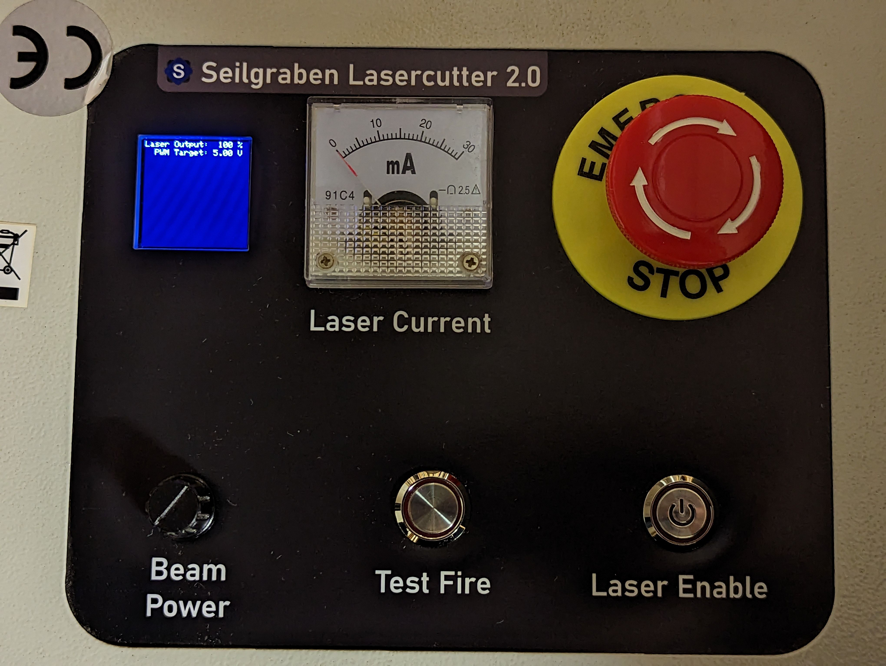

# Arduino-based LCD Front Panel for K40 Laser Cutters

## Features
- LCD display with rotary encoder
- Fine-grained output power setting (in 1% increments)
- Power setting can be saved to EEPROM and is restored on power-up
- Cooling loop sensor input: turns off laser if water flow is interrupted 
  - Can be overridden by pressing the encoder for more than 2 seconds
- No warranty for any of the above! Please don't call me if your laser catches fire.

## Pins
- Encoder Button: A2, A1, A3 (A, B, Button)
- PWM Output to Laser PSU: 11
- Water Sensor Input: A0
- I2C Display: A4, A5 (SDA, SCL)

## Libraries
- [LiquidCrystal_I2C](https://https://github.com/fdebrabander/Arduino-LiquidCrystal-I2C-library)
- [ClickEncoder](https://github.com/0xPIT/encoder)
- [TimerOne](https://github.com/PaulStoffregen/TimerOne)